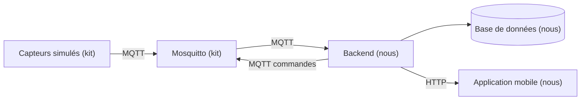

# Architecture

> À compléter en J1, une fois la stack choisie.

## Vue d'ensemble

## Technologies retenues

| Couche | Techno | Version |
|---|---|---|
| Runtime | Node.js LTS | 24.21.0 |
| Client MQTT | MQTT.js | 5.15.2 |
| API | Express | 5.2.1 |
| Base | SQLite via better-sqlite3 | 13.0.3 |
| Validation | Zod | 4.6.5 |
| Authentification | jose et bcryptjs | 6.2.12 et 3.0.3 |
| Traces | Pino | 10.3.1 |
| Mobile | Expo SDK 57 (React Native 0.86) | expo 57.0.22 |

Nous avons choisi Node parce que le mobile est en React Native : un seul langage pour les
deux côtés, et le schéma de validation d'un message de télémétrie est écrit une seule fois.

Nous avons choisi Express plutôt que NestJS parce qu'il n'y a rien à apprendre de sa
structure, et que sur 4 jours à deux le temps passé à défendre une architecture à l'oral
est du temps pris sur le projet lui-même. Plutôt que Fastify, parce que son avantage
principal est la validation des requêtes HTTP, alors que la validation qui compte chez nous
porte sur les messages MQTT.

Nous avons choisi SQLite parce que notre backend est le seul à écrire dans la base, et
parce qu'un service de base de données en moins dans le Compose, c'est un healthcheck, un
ordre de démarrage et des identifiants en moins le jour où il faut relancer le projet
devant le jury en suivant le seul README.

Nous avons choisi Expo plutôt que React Native nu parce qu'ajouter une bibliothèque en
React Native nu impose de recompiler en natif à chaque fois, alors que les modules dont
nous avons besoin sont déjà compilés dans Expo Go. La documentation officielle de React
Native recommande d'ailleurs de partir d'un framework et cite Expo.

Le détail de chaque choix, avec les alternatives écartées et ce que ça nous coûte, est dans
`docs/decisions/`.

## Flux des données

À compléter.

## Règles à documenter

| Paramètre | Valeur | Pourquoi |
|---|---|---|
| Seuil de fraîcheur d'une mesure | à définir | |
| Délai maximum d'attente d'une commande | à définir | |
| Règle d'alerte CO2 | à définir | |
