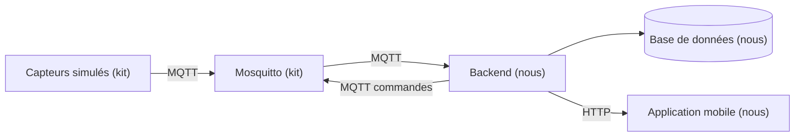

# Architecture

> À compléter en J1, une fois la stack choisie.

## Vue d'ensemble

## Technologies retenues

| Couche | Techno | Version |
|---|---|---|
| Runtime | Node.js LTS | 24.21.0 |
| Client MQTT | MQTT.js | 5.15.2 |
| API | Express | 5.2.1 |
| Base | SQLite via better-sqlite3 | 13.0.3 |
| Validation | Zod | 4.6.5 |
| Authentification | jose et bcryptjs | 6.2.12 et 3.0.3 |
| Traces | Pino | 10.3.1 |
| Mobile | Expo SDK 57 (React Native 0.86) | expo 57.0.22 |

Nous avons choisi Node parce que l'application mobile est déjà en JavaScript. En écrivant
le backend dans le même langage, on décrit le format d'un message une seule fois au lieu de
deux.

Nous avons choisi Express parce qu'on n'a que quelques routes à exposer. NestJS nous
obligerait à apprendre sa façon de structurer une application, et on a 4 jours. Fastify
serait plus rapide, mais avec 3 capteurs on ne verrait pas la différence.

Nous avons choisi SQLite parce que c'est un simple fichier, sans serveur à lancer à côté.
Ça fait un service de moins qui peut tomber en panne le jour où on relance tout le projet
devant le jury. Et avec 3 capteurs qui envoient une mesure toutes les 2 secondes, on n'a
pas besoin d'une base plus grosse.

Nous avons choisi Expo parce qu'avec React Native seul, il faut recompiler l'application
entière à chaque fois qu'on ajoute une bibliothèque, ce qui prend plusieurs minutes. Avec
Expo, tout ce dont on a besoin est déjà inclus : on enregistre le fichier et le téléphone
se met à jour.

Le détail de chaque choix, avec les alternatives écartées et ce que ça nous coûte, est dans
`docs/decisions/`.

## Flux des données

À compléter.

## Règles à documenter

| Paramètre | Valeur | Pourquoi |
|---|---|---|
| Seuil de fraîcheur d'une mesure | à définir | |
| Délai maximum d'attente d'une commande | à définir | |
| Règle d'alerte CO2 | à définir | |
