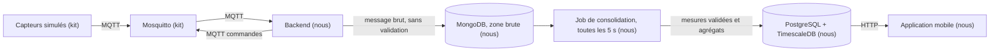

# Architecture



Le consommateur MQTT n'écrit pas dans PostgreSQL. Le pourquoi et ce que ça coûte sont dans
`docs/decisions/J2/08-base-brute-mongodb.md`.

## Technologies retenues

| Couche | Techno | Version |
|---|---|---|
| Runtime | Node.js LTS | 24.21.0 |
| Langage | TypeScript | 7.0.2 |
| API | Fastify | 5.12.4 |
| Client MQTT | mqtt | 5.15.2 |
| Base | PostgreSQL | 18.6 |
| Séries temporelles | TimescaleDB | 2.30.0 |
| Zone brute | MongoDB | 8.3.11 |
| Pilote MongoDB | mongodb | 7.6.0 |
| Accès aux données | pg et Kysely | 8.23.0 et 0.29.5 |
| Migrations | node-pg-migrate | 9.0.0 |
| Validation | Zod | 4.6.5 |
| Authentification | @fastify/jwt et argon2 | 10.2.2 et 0.45.1 |
| Traces | Pino | 10.3.1 |
| Mobile | Expo SDK 57 (React Native 0.86) | expo 57.0.22 |
| Navigation mobile | Expo Router | 57.0.21 |
| Réseau et cache mobile | TanStack Query | 5.102.8 |
| Persistance du cache mobile | react-query-persist-client, query-async-storage-persister | 5.103.0 |
| Détection du réseau | NetInfo | 12.0.1 |
| Stockage local | AsyncStorage | 2.2.0 |
| Jeton sur le téléphone | expo-secure-store | 57.0.4 |
| Interface | React Native Paper | 5.15.3 |
| Scan de QR | expo-camera | 57.0.5 |

Aucune bibliothèque d'état global. TanStack Query gère les données du serveur, le jeton tient
dans un contexte React. Le choix de chaque brique et ce qu'elle coûte sont dans
`docs/decisions/J1/`.

## Organisation du code

```
backend/src/
  schemas/    schémas Zod : le format des messages et des requêtes
  domain/     les règles : doublon, ordre des mesures, fraîcheur, tranches d'agrégat
  db/         requêtes SQL, accès à la zone brute, migrations
  mqtt/       connexion au broker, abonnements, écriture du brut
  jobs/       le job de consolidation, et le script de rejeu
  http/       routes Fastify
```

`mqtt/` et `http/` appellent `domain/`, jamais l'inverse. Hexagonale, CQRS et microservices
ont été examinés et écartés, voir `docs/decisions/J1/04-architecture-du-backend.md`.

```
mobile/src/
  app/         les routes Expo Router, rien d'autre
  api/         client HTTP, schémas Zod, requêtes
  components/  composants d'affichage réutilisés
  lib/         fonctions sans dépendance, cache, détection du réseau, horloge
```

Seul `app/` connaît les routes, seul `api/` appelle le réseau. Les trois écrans lisent la même
réponse de `GET /rooms` sous une seule clé de cache. Le découpage par domaine a été examiné et
écarté, voir `docs/decisions/J1/07-architecture-de-l-application-mobile.md`.

## Actualisation côté mobile

Récent veut dire une mesure de moins de 30 secondes. Le backend calcule ce verdict et le
renvoie dans le champ `is_stale`, car l'horloge du téléphone peut différer. Une réponse gardée
en cache fige ce champ, donc passé 30 secondes l'écran annonce « fraîcheur inconnue ». Le
cache hors ligne est dans `docs/decisions/J2/09-cache-hors-ligne-et-fraicheur.md`.

| Déclencheur | Comportement |
|---|---|
| Ouverture d'un écran | Appel si les données en cache ont plus de 15 secondes |
| Retour de l'application au premier plan | Nouvel appel |
| Retour du réseau | Nouvel appel |
| Pendant qu'un écran est ouvert | Rafraîchissement toutes les 15 secondes |
| Après l'envoi d'une commande | Interrogation du suivi toutes les 2 secondes, jusqu'à un statut définitif ou 15 secondes |

Le rafraîchissement périodique s'arrête en arrière-plan, donc un écran laissé derrière ne se
met pas à jour tout seul.

## Règles à documenter

Ces valeurs sont déclarées avant les tests de recette, comme le demande le sujet.

| Paramètre | Valeur | Pourquoi cette valeur |
|---|---|---|
| Seuil de fraîcheur d'une mesure | 30 secondes | Les capteurs publient toutes les 2 secondes : 30 secondes valent 15 mesures manquées, ce n'est plus un aléa réseau. Assez long pour absorber une reconnexion du broker, assez court pour le montrer en démonstration |
| Expiration d'une commande | 10 secondes | C'est nous qui la choisissons : le contrat impose seulement une date future, et l'outil du kit utilise 15 secondes. Passé ce délai, l'objet refuse d'exécuter |
| Attente maximale d'une commande | 15 secondes | Plus longue que l'expiration. Abandonner avant laisserait l'objet exécuter après notre abandon, et on afficherait un échec faux |
| Alerte CO2, déclenchement | 1000 ppm | Au-dessus de la valeur repère de 800 ppm du HCSP |
| Alerte CO2, retour à la normale | 800 ppm | Retour à la valeur repère. L'écart de 200 ppm empêche l'alerte de clignoter autour d'une valeur unique |
| Rétention de l'historique | 7 jours | Assez pour montrer une évolution sur plusieurs jours, assez court pour que la suppression automatique soit observable |
| Taille maximale d'une page d'historique | 500 points | Borne les lectures, pour qu'une requête ne bloque pas l'ingestion |
| Rafraîchissement du mobile | 15 secondes | Sous le seuil de fraîcheur, donc l'affichage ne passe jamais en ancien à cause de notre propre rythme. Rafraîchir toutes les 2 secondes afficherait des variations d'un point de CO2 et viderait la batterie |
| Période du job de consolidation | 5 secondes | Une mesure attend au pire un passage avant d'être visible. 5 secondes valent un sixième du seuil de fraîcheur, et un tiers du rythme du mobile |
| Largeur d'une tranche d'agrégat | 5 minutes | 72 tranches couvrent six heures, sous la limite de 500 points. À la mesure brute, six heures feraient 10 000 points |
| Rétention de la zone brute | 7 jours | La même que l'historique consolidé : le brut sert à recalculer la période qu'on affiche, pas au-delà |
| Durée du cache sur le téléphone | 24 heures | Au-delà, des mesures de salle ne décrivent plus rien, même datées |

Une seule alerte ouverte par salle. Tant qu'elle est ouverte, les mesures au-dessus de
1000 ppm la mettent à jour au lieu d'en créer une nouvelle, et une mesure invalide ne doit ni
ouvrir ni fermer une alerte. L'écart de 200 ppm vaut environ 17 mesures de montée sans
ventilation et 5 mesures de descente avec, donc une valeur qui oscille ne les traverse pas.

Le HCSP retient 800 ppm comme valeur repère d'un renouvellement d'air satisfaisant et
1500 ppm comme valeur d'action rapide, dans son avis du 21 janvier 2022 sur la mesure du CO2
dans les établissements recevant du public. Notre seuil de 1000 ppm est un choix entre ces
deux valeurs, pas une norme.
