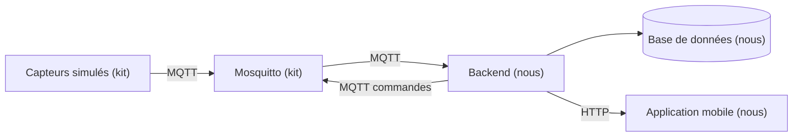

# Architecture

> À compléter en J1, une fois la stack choisie.

## Vue d'ensemble

## Technologies retenues

| Couche | Techno | Justification |
|---|---|---|
| Backend | à définir | |
| Base de données | à définir | |
| Mobile | à définir | |

## Flux des données

À compléter.

## Règles à documenter

| Paramètre | Valeur | Pourquoi |
|---|---|---|
| Seuil de fraîcheur d'une mesure | à définir | |
| Délai maximum d'attente d'une commande | à définir | |
| Règle d'alerte CO2 | à définir | |
