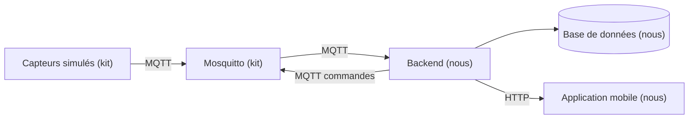

# Architecture

> À compléter en J1, une fois la stack choisie.

## Vue d'ensemble

## Technologies retenues

Les justifications complètes sont dans `docs/decisions/`.

| Couche | Techno | Version | En une phrase |
|---|---|---|---|
| Runtime | Node.js LTS | 24.21.0 | Même langage que le mobile |
| Client MQTT | MQTT.js | 5.15.2 | Seul client Node maintenu, reconnexion et QoS 1 inclus |
| API | Express | 5.2.1 | Ne prend pas le contrôle du démarrage, ce qui laisse ouvrir MQTT en premier |
| Base | SQLite (better-sqlite3) | 13.0.3 | Un seul écrivain, unicité gérée par la base, aucun service à administrer |
| Validation | Zod | 4.6.5 | Rejet des messages invalides avec une erreur explicable dans les traces |
| Authentification | jose et bcryptjs | 6.2.12 et 3.0.3 | JWT sans état, pas de stockage de sessions |
| Traces | Pino | 10.3.1 | Logs JSON filtrables par device_id et command_id |
| Mobile | React Native avec Expo | SDK à figer en J1 | Caméra, réseau, cache et cycle de vie fournis par le SDK |

## Flux des données

À compléter.

## Règles à documenter

| Paramètre | Valeur | Pourquoi |
|---|---|---|
| Seuil de fraîcheur d'une mesure | à définir | |
| Délai maximum d'attente d'une commande | à définir | |
| Règle d'alerte CO2 | à définir | |
