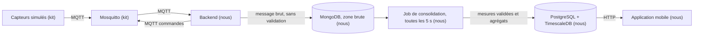

# Architecture



Le consommateur MQTT n'écrit plus directement dans PostgreSQL. Il dépose le message tel qu'il
arrive dans MongoDB, sans le valider ni rien en calculer. Un job le relit toutes les
5 secondes, applique les règles métier et écrit le résultat dans PostgreSQL. L'application ne
lit que PostgreSQL. Le pourquoi et ce que ça coûte sont dans
`docs/decisions/08-base-brute-mongodb.md`.

## Technologies retenues

Le choix de chacune, les alternatives écartées et ce qu'elle coûte sont dans
`docs/decisions/`.

| Couche | Techno | Version |
|---|---|---|
| Runtime | Node.js LTS | 24.21.0 |
| Langage | TypeScript | 7.0.2 |
| API | Fastify | 5.12.4 |
| Client MQTT | mqtt | 5.15.2 |
| Base | PostgreSQL | 18.6 |
| Séries temporelles | TimescaleDB | 2.30.0 |
| Zone brute | MongoDB | 8.3.11 |
| Pilote MongoDB | mongodb | 7.6.0 |
| Accès aux données | pg et Kysely | 8.23.0 et 0.29.5 |
| Migrations | node-pg-migrate | 9.0.0 |
| Validation | Zod | 4.6.5 |
| Authentification | @fastify/jwt et argon2 | 10.2.2 et 0.45.1 |
| Traces | Pino | 10.3.1 |
| Mobile | Expo SDK 57 (React Native 0.86) | expo 57.0.22 |
| Navigation mobile | Expo Router | 57.0.21 |
| Réseau et cache mobile | TanStack Query | 5.102.8 |
| Persistance du cache mobile | react-query-persist-client, query-async-storage-persister | 5.103.0 |
| Détection du réseau | NetInfo | 12.0.1 |
| Stockage local | AsyncStorage | 2.2.0 |
| Jeton sur le téléphone | expo-secure-store | 57.0.4 |
| Interface | React Native Paper | 5.15.3 |
| Scan de QR | expo-camera | 57.0.5 |

Aucune bibliothèque d'état global : les données viennent du serveur et sont gérées par
TanStack Query, le jeton tient dans un contexte React.

## Organisation du code

```
backend/src/
  schemas/    schémas Zod : le format des messages et des requêtes
  domain/     les règles : doublon, ordre des mesures, fraîcheur, tranches d'agrégat
  db/         requêtes SQL, accès à la zone brute, migrations
  mqtt/       connexion au broker, abonnements, écriture du brut
  jobs/       le job de consolidation, et le script de rejeu
  http/       routes Fastify
```

Règle de dépendance : `mqtt/` et `http/` appellent `domain/`, jamais l'inverse. Hexagonale,
CQRS et microservices ont été examinés et écartés, voir
`docs/decisions/04-architecture-du-backend.md`.

```
mobile/src/
  app/         les routes Expo Router, rien d'autre
  api/         client HTTP, schémas Zod, requêtes
  components/  composants d'affichage réutilisés
  lib/         fonctions sans dépendance, cache, détection du réseau, horloge
```

Règles de dépendance : seul `app/` connaît les routes, seul `api/` appelle le réseau. Le
découpage par domaine a été examiné et écarté, voir
`docs/decisions/07-architecture-de-l-application-mobile.md`.

Les trois écrans lisent la même réponse de `GET /rooms`, sous une seule clé de cache. Le
détail d'une salle et celui d'un objet en sont dérivés, pas rechargés : deux écrans ne
peuvent donc pas afficher deux valeurs différentes du même capteur.

## Actualisation côté mobile

Le sujet demande d'expliquer comment l'application actualise ses données et ce que
« récent » veut dire.

Récent : une mesure de moins de 30 secondes, seuil calculé par le backend et renvoyé dans
le champ `is_stale` de l'API. Le téléphone ne le recalcule pas, son horloge peut différer.

Ce champ est figé dans une réponse gardée en cache. Au-delà de 30 secondes d'ancienneté de la
réponse elle-même, l'écran cesse donc d'affirmer qu'une mesure est récente et affiche
« fraîcheur inconnue ». Détail dans `docs/decisions/09-cache-hors-ligne-et-fraicheur.md`.

| Déclencheur | Comportement |
|---|---|
| Ouverture d'un écran | Appel si les données en cache ont plus de 15 secondes |
| Retour de l'application au premier plan | Nouvel appel |
| Retour du réseau | Nouvel appel |
| Pendant qu'un écran est ouvert | Rafraîchissement toutes les 15 secondes |
| Après l'envoi d'une commande | Interrogation du suivi toutes les 2 secondes, jusqu'à un statut définitif ou 15 secondes |

L'écran distingue quatre états : chargement, vide, erreur, et donnée ancienne. L'état hors
ligne est à part, il concerne le téléphone et non la donnée.

Trois situations ne doivent jamais être confondues : l'objet est déconnecté, l'objet est en
ligne mais ne mesure plus, ou le téléphone n'a plus de réseau.

Le rafraîchissement périodique s'arrête quand l'application n'est pas au premier plan, et
reprend au retour. Un écran laissé en arrière-plan ne se met donc pas à jour tout seul.

## Cache hors ligne

Les réponses sont écrites sur le disque du téléphone et gardées 24 heures. Sans réseau,
l'application affiche les dernières valeurs connues avec la date à laquelle elles ont été
reçues, au lieu d'un écran d'erreur. Un bandeau nomme la cause, et il parle du lien avec le
serveur, jamais du capteur.

| Situation | Ce que le bandeau dit |
|---|---|
| Le téléphone n'a pas de réseau | Téléphone hors ligne |
| Le téléphone a du réseau, le serveur ne répond pas | Serveur injoignable |
| Tout fonctionne mais la dernière réponse dépasse 30 secondes | Données du cache |
| Tout fonctionne | Rien |

Sans aucune donnée en cache et sans réseau, l'écran le dit et propose de réessayer. Il
n'affiche jamais un chargement qui ne se terminera pas.

## Flux des données

**Une mesure.** Le capteur publie sur `campus/v1/devices/{id}/telemetry`. Le backend, abonné
en permanence, valide le message, l'écarte si c'est un doublon, l'écrit dans l'historique, et
met à jour le dernier état seulement si la mesure est plus récente. Le mobile lit ce dernier
état via `GET /rooms`.

**Un historique.** Le job de consolidation calcule des tranches de 5 minutes par objet, avec
moyenne, minimum et maximum. L'écran de détail lit ces tranches par
`GET /devices/:id/telemetry?resolution=5m`, et jamais les mesures brutes : six heures
d'historique brut font environ 10 000 lignes, contre 72 tranches. Les mesures brutes restent
lisibles avec `resolution=raw`, bornées elles aussi.

**Une commande.** Le mobile appelle `POST /devices/:id/commands`. Le backend enregistre la
commande en attente, publie sur `campus/v1/devices/{id}/commands`, puis attend le résultat
sur `.../results`. Le mobile suit l'avancement avec `GET /commands/:id`. L'état réel de la
ventilation ne vient pas de la commande mais du topic `state`.

## Règles à documenter

Ces valeurs sont déclarées avant les tests de recette, comme le demande le sujet.

| Paramètre | Valeur | Pourquoi cette valeur |
|---|---|---|
| Seuil de fraîcheur d'une mesure | 30 secondes | Les capteurs publient toutes les 2 secondes : 30 secondes valent 15 mesures manquées, ce n'est plus un aléa réseau. Assez long pour absorber une reconnexion du broker, assez court pour le montrer en démonstration |
| Expiration d'une commande | 10 secondes | C'est nous qui la choisissons : le contrat impose seulement une date future, et l'outil du kit utilise 15 secondes. Passé ce délai, l'objet refuse d'exécuter |
| Attente maximale d'une commande | 15 secondes | Plus longue que l'expiration. Abandonner avant laisserait l'objet exécuter après notre abandon, et on afficherait un échec faux |
| Alerte CO2, déclenchement | 1000 ppm | Au-dessus de la valeur repère de 800 ppm du HCSP |
| Alerte CO2, retour à la normale | 800 ppm | Retour à la valeur repère. L'écart de 200 ppm empêche l'alerte de clignoter autour d'une valeur unique |
| Rétention de l'historique | 7 jours | Assez pour montrer une évolution sur plusieurs jours, assez court pour que la suppression automatique soit observable |
| Taille maximale d'une page d'historique | 500 points | Borne les lectures, pour qu'une requête ne bloque pas l'ingestion |
| Rafraîchissement du mobile | 15 secondes | Sous le seuil de fraîcheur, donc l'affichage ne passe jamais en ancien à cause de notre propre rythme. Rafraîchir toutes les 2 secondes afficherait des variations d'un point de CO2 et viderait la batterie |
| Période du job de consolidation | 5 secondes | Une mesure attend au pire un passage avant d'être visible. 5 secondes valent un sixième du seuil de fraîcheur, et un tiers du rythme du mobile |
| Largeur d'une tranche d'agrégat | 5 minutes | 72 tranches couvrent six heures, sous la limite de 500 points. À la mesure brute, six heures feraient 10 000 points |
| Rétention de la zone brute | 7 jours | La même que l'historique consolidé : le brut sert à recalculer la période qu'on affiche, pas au-delà |
| Durée du cache sur le téléphone | 24 heures | Au-delà, des mesures de salle ne décrivent plus rien, même datées |

Une seule alerte ouverte par salle : tant qu'elle est ouverte, les mesures au-dessus de
1000 ppm la mettent à jour au lieu d'en créer une nouvelle. L'écart de 200 ppm entre les deux
seuils vaut environ 17 mesures de montée sans ventilation et 5 mesures de descente avec, donc
bien plus que le bruit du modèle : une valeur qui oscille ne peut pas traverser les deux
seuils. Une mesure invalide ne doit ni ouvrir ni fermer une alerte.

Source des seuils : le HCSP retient 800 ppm comme valeur repère d'un renouvellement d'air
satisfaisant et 1500 ppm comme valeur d'action rapide, dans son avis du 21 janvier 2022 sur
la mesure du CO2 dans les établissements recevant du public. Notre seuil de 1000 ppm n'est
pas une norme, c'est notre choix entre ces deux valeurs.
