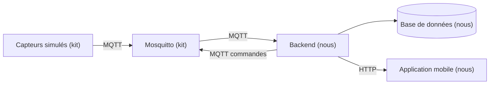

# Architecture

> À compléter en J1, une fois la stack choisie.

## Vue d'ensemble

## Technologies retenues

| Couche | Techno | Version | Pourquoi ce choix |
|---|---|---|---|
| Runtime | Node.js LTS | 24.21.0 | Nous avons choisi Node parce que l'application mobile est déjà en JavaScript. En écrivant le backend dans le même langage, on décrit le format d'un message une seule fois au lieu de deux |
| Client MQTT | MQTT.js | 5.15.2 | Nous avons choisi MQTT.js parce que c'est la bibliothèque de référence en Node, et parce qu'elle se reconnecte toute seule quand le broker redémarre |
| API | Express | 5.2.1 | Nous avons choisi Express parce qu'on n'a que quelques routes à exposer. NestJS nous obligerait à apprendre sa façon de structurer une application, et on a 4 jours |
| Base | SQLite via better-sqlite3 | 13.0.3 | Nous avons choisi SQLite parce que c'est un simple fichier, sans serveur à lancer à côté. Ça fait un service de moins qui peut tomber en panne quand on relance tout le projet. Et avec 3 capteurs qui envoient une mesure toutes les 2 secondes, on n'a pas besoin d'une base plus grosse |
| Validation | Zod | 4.6.5 | Nous avons choisi Zod parce que quand un message est mal formé, il nous dit quel champ pose problème et pourquoi. On écrit cette raison dans les logs pour justifier le rejet |
| Authentification | jose et bcryptjs | 6.2.12 et 3.0.3 | Nous avons choisi jose parce que le backend n'a pas besoin de garder la liste des gens connectés : il vérifie la signature du jeton à chaque appel |
| Traces | Pino | 10.3.1 | Nous avons choisi Pino parce qu'il écrit les logs en JSON, donc on retrouve tout le parcours d'une commande en filtrant sur son numéro |
| Mobile | Expo SDK 57 (React Native 0.86) | expo 57.0.22 | Nous avons choisi Expo parce qu'avec React Native seul, il faut recompiler l'application entière à chaque fois qu'on ajoute une bibliothèque. Avec Expo tout est déjà inclus : on enregistre le fichier et le téléphone se met à jour |

Les alternatives écartées et ce que chaque choix nous coûte sont dans `docs/decisions/`.

## Flux des données

À compléter.

## Règles à documenter

| Paramètre | Valeur | Pourquoi |
|---|---|---|
| Seuil de fraîcheur d'une mesure | à définir | |
| Délai maximum d'attente d'une commande | à définir | |
| Règle d'alerte CO2 | à définir | |
