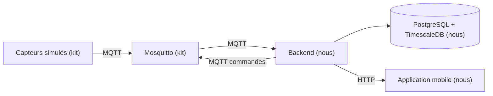

# Architecture

> À compléter en J1, une fois la stack choisie.

## Vue d'ensemble



## Technologies retenues

| Couche | Techno | Version | Pourquoi ce choix |
|---|---|---|---|
| Runtime | Node.js LTS | 24.21.0 | Nous avons choisi Node parce que l'application mobile est déjà en JavaScript. En écrivant le backend dans le même langage, on décrit le format d'un message une seule fois au lieu de deux |
| Langage | TypeScript | 7.0.2 | Nous avons choisi TypeScript parce que l'erreur la plus fréquente ici est de lire un champ qui n'existe pas dans un message. Avec des types, l'erreur apparaît à la compilation au lieu d'apparaître en démonstration |
| API | Fastify | 5.12.4 | Nous avons choisi Fastify parce qu'il réutilise pour les routes HTTP les schémas Zod qu'on écrit déjà pour valider les messages MQTT. Un schéma, deux usages, au lieu de revalider à la main dans chaque route |
| Client MQTT | mqtt | 5.15.2 | Nous avons choisi MQTT.js parce que c'est la bibliothèque de référence en Node, et parce qu'elle se reconnecte toute seule quand le broker redémarre |
| Base | PostgreSQL | 18.6 | Nous avons choisi une base relationnelle parce que nos données sont pleines de liens à garantir, et parce que la déduplication doit être une contrainte d'unicité vérifiée par la base et non un test écrit dans notre code |
| Séries temporelles | TimescaleDB | 2.30.0 | Nous avons choisi TimescaleDB parce que c'est une extension de PostgreSQL et pas une deuxième base. Sa politique de rétention supprime automatiquement les vieilles mesures, ce qui règle l'historique borné demandé par le sujet |
| Accès aux données | pg et Kysely | 8.23.0 et 0.29.5 | Nous avons choisi d'écrire du SQL plutôt qu'un ORM parce que nos deux requêtes clés, l'insertion qui ignore les doublons et la mise à jour conditionnelle sur la date, sont justement celles que les ORM rendent pénibles |
| Migrations | node-pg-migrate | 9.0.0 | Nous avons choisi des migrations versionnées parce qu'en production on ne rejoue pas un fichier de schéma à la main et on ne laisse pas un ORM modifier le schéma tout seul |
| Validation | Zod | 4.6.5 | Nous avons choisi Zod parce que quand un message est mal formé, il nous dit quel champ pose problème et pourquoi. On écrit cette raison dans les logs pour justifier le rejet |
| Authentification | @fastify/jwt et argon2 | 10.2.2 et 0.45.1 | Nous avons choisi le JWT parce que le backend n'a pas besoin de garder la liste des gens connectés, et argon2 parce que c'est la recommandation actuelle pour hacher un mot de passe |
| Traces | Pino | 10.3.1 | Nous avons choisi Pino parce qu'il écrit les logs en JSON, donc on retrouve tout le parcours d'une commande en filtrant sur son numéro. Il est déjà intégré à Fastify |
| Mobile | Expo SDK 57 (React Native 0.86) | expo 57.0.22 | Nous avons choisi Expo parce qu'avec React Native seul, il faut recompiler l'application entière à chaque fois qu'on ajoute une bibliothèque. Avec Expo tout est déjà inclus : on enregistre le fichier et le téléphone se met à jour |

Les alternatives écartées et ce que chaque choix nous coûte sont dans `docs/decisions/`.

## Organisation du code

```
backend/src/
  schemas/    schémas Zod : le format des messages et des requêtes
  domain/     les règles : doublon, ordre des mesures, fraîcheur, commandes, alertes
  db/         requêtes SQL et migrations
  mqtt/       connexion au broker, abonnements, publication des commandes
  http/       routes Fastify
```

| Sujet | Choix | Pourquoi ce choix |
|---|---|---|
| Architecture du backend | En couches, avec les règles métier isolées dans `domain/` | Nous avons choisi cette organisation parce que nos règles ne doivent dépendre ni du broker ni du serveur HTTP. Un test qui vérifie qu'un message rejoué ne crée pas de doublon appelle une fonction et lui passe deux messages, au lieu de devoir lancer un broker. Le sujet compte le test automatisé comme une meilleure preuve qu'une capture d'écran |
| Règle de dépendance | `mqtt/` et `http/` appellent `domain/`, jamais l'inverse | Nous avons choisi cette règle parce que le seuil de fraîcheur sert à la fois à l'ingestion et à l'affichage. S'il était écrit dans le code MQTT puis redéfini dans une route, les deux finiraient par diverger |
| Architecture hexagonale | Écartée | Nous l'avons écartée parce qu'elle ajoute des interfaces pour pouvoir changer de base ou de broker, alors que notre broker est imposé par le sujet et notre base choisie pour 4 jours. Son bénéfice réel, isoler le métier, on l'a déjà avec la règle de dépendance |
| CQRS | Écarté | Nous l'avons écarté parce qu'il sépare le modèle d'écriture du modèle de lecture, alors que nos deux chemins travaillent sur les mêmes tables. Notre table de dernier état joue déjà ce rôle en une requête SQL |
| Microservices | Écartés | Nous les avons écartés parce que séparer l'ingestion de l'API obligerait à partager l'état entre deux services, alors que c'est justement la cohérence de cet état, le doublon et l'ordre des mesures, qui est notée |

Le détail de chaque point est dans `docs/decisions/04-architecture-du-backend.md`.

## Flux des données

À compléter.

## Règles à documenter

Ces valeurs sont déclarées avant les tests de recette, comme le demande le sujet.

| Paramètre | Valeur | Pourquoi cette valeur |
|---|---|---|
| Seuil de fraîcheur d'une mesure | 30 secondes | Les capteurs publient toutes les 2 secondes. 30 secondes, c'est 15 mesures manquées : on ne peut plus parler d'un aléa réseau. C'est aussi assez long pour absorber une reconnexion ou un redémarrage du broker, et assez court pour le montrer en démonstration |
| Expiration d'une commande | 10 secondes | Passé ce délai, l'objet refuse d'exécuter la commande. C'est le champ `expires_at` du contrat MQTT |
| Attente maximale d'une commande | 15 secondes | On attend plus longtemps que l'expiration. Si on abandonnait avant, l'objet pourrait encore exécuter la commande après notre abandon, et on afficherait un échec faux |
| Alerte CO2, déclenchement | 1000 ppm | Au-dessus de la valeur repère de 800 ppm du HCSP, qui correspond à un renouvellement d'air satisfaisant |
| Alerte CO2, retour à la normale | 800 ppm | On ne referme l'alerte qu'au retour à la valeur repère. L'écart de 200 ppm avec le seuil de déclenchement empêche l'alerte de clignoter autour d'une valeur unique |

### Ce que ces valeurs impliquent

**Fraîcheur.** L'âge est calculé par le backend et exposé dans l'API. Le mobile ne le
recalcule pas avec sa propre horloge, qui peut différer. Une mesure ancienne reste affichée
avec sa date, on ne la remplace pas par un tiret.

**Commandes.** Au bout de 15 secondes sans réponse, le statut est `unknown`, pas `failed` :
on ne sait pas si l'action a eu lieu. Une réponse tardive est quand même traitée, corrélée
par son `command_id`. Une commande abandonnée n'est jamais rejouée automatiquement, et
toute nouvelle intention utilise un nouveau `command_id`.

**Alertes.** Une seule alerte ouverte par salle. Tant qu'elle est ouverte, les mesures
au-dessus de 1000 ppm la mettent à jour au lieu d'en créer une nouvelle. C'est ce qui évite
la répétition à chaque message.

Deux seuils différents pour ouvrir et pour fermer, c'est ce qu'on appelle une hystérésis,
le principe classique des systèmes d'alarme. L'écart de 200 ppm vaut environ 17 mesures de
montée sans ventilation et 5 mesures de descente avec, donc bien plus que le bruit du
modèle : une valeur qui oscille ne peut pas traverser les deux seuils.

Une mesure invalide est rejetée à la validation et ne doit ni ouvrir ni fermer une alerte.

### Sources pour les seuils de CO2

Le HCSP retient 800 ppm comme valeur repère d'un renouvellement d'air satisfaisant et
1500 ppm comme valeur d'action rapide, dans son avis du 21 janvier 2022 sur la mesure du
CO2 dans les établissements recevant du public.

À savoir pour l'oral : le seuil de 1000 ppm souvent cité n'est pas une norme. L'ASHRAE
rappelle que le CO2 à ces niveaux est un indicateur de renouvellement d'air, pas un
polluant toxique. Nos 1000 ppm sont donc un seuil produit assumé, pas une obligation
réglementaire.
