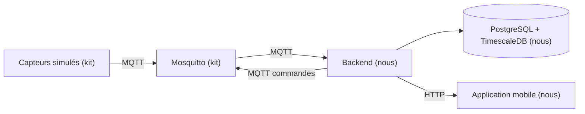

# Architecture

> À compléter en J1, une fois la stack choisie.

## Vue d'ensemble



## Technologies retenues

| Couche | Techno | Version | Pourquoi ce choix |
|---|---|---|---|
| Runtime | Node.js LTS | 24.21.0 | Nous avons choisi Node parce que l'application mobile est déjà en JavaScript. En écrivant le backend dans le même langage, on décrit le format d'un message une seule fois au lieu de deux |
| Langage | TypeScript | 7.0.2 | Nous avons choisi TypeScript parce que l'erreur la plus fréquente ici est de lire un champ qui n'existe pas dans un message. Avec des types, l'erreur apparaît à la compilation au lieu d'apparaître en démonstration |
| API | Fastify | 5.12.4 | Nous avons choisi Fastify parce qu'il réutilise pour les routes HTTP les schémas Zod qu'on écrit déjà pour valider les messages MQTT. Un schéma, deux usages, au lieu de revalider à la main dans chaque route |
| Client MQTT | mqtt | 5.15.2 | Nous avons choisi MQTT.js parce que c'est la bibliothèque de référence en Node, et parce qu'elle se reconnecte toute seule quand le broker redémarre |
| Base | PostgreSQL | 18.6 | Nous avons choisi une base relationnelle parce que nos données sont pleines de liens à garantir, et parce que la déduplication doit être une contrainte d'unicité vérifiée par la base et non un test écrit dans notre code |
| Séries temporelles | TimescaleDB | 2.30.0 | Nous avons choisi TimescaleDB parce que c'est une extension de PostgreSQL et pas une deuxième base. Sa politique de rétention supprime automatiquement les vieilles mesures, ce qui règle l'historique borné demandé par le sujet |
| Accès aux données | pg et Kysely | 8.23.0 et 0.29.5 | Nous avons choisi d'écrire du SQL plutôt qu'un ORM parce que nos deux requêtes clés, l'insertion qui ignore les doublons et la mise à jour conditionnelle sur la date, sont justement celles que les ORM rendent pénibles |
| Migrations | node-pg-migrate | 9.0.0 | Nous avons choisi des migrations versionnées parce qu'en production on ne rejoue pas un fichier de schéma à la main et on ne laisse pas un ORM modifier le schéma tout seul |
| Validation | Zod | 4.6.5 | Nous avons choisi Zod parce que quand un message est mal formé, il nous dit quel champ pose problème et pourquoi. On écrit cette raison dans les logs pour justifier le rejet |
| Authentification | @fastify/jwt et argon2 | 10.2.2 et 0.45.1 | Nous avons choisi le JWT parce que le backend n'a pas besoin de garder la liste des gens connectés, et argon2 parce que c'est la recommandation actuelle pour hacher un mot de passe |
| Traces | Pino | 10.3.1 | Nous avons choisi Pino parce qu'il écrit les logs en JSON, donc on retrouve tout le parcours d'une commande en filtrant sur son numéro. Il est déjà intégré à Fastify |
| Mobile | Expo SDK 57 (React Native 0.86) | expo 57.0.22 | Nous avons choisi Expo parce qu'avec React Native seul, il faut recompiler l'application entière à chaque fois qu'on ajoute une bibliothèque. Avec Expo tout est déjà inclus : on enregistre le fichier et le téléphone se met à jour |

Les alternatives écartées et ce que chaque choix nous coûte sont dans `docs/decisions/`.

## Organisation du code

```
backend/src/
  schemas/    schémas Zod, partagés entre MQTT et HTTP
  domain/     les règles : doublon, ordre des mesures, fraîcheur, commandes, alertes
  db/         requêtes SQL et migrations
  mqtt/       connexion au broker, abonnements, publication des commandes
  http/       routes Fastify
```

Architecture en couches, avec les règles métier isolées dans `domain/`. `mqtt/` et `http/`
appellent `domain/`, jamais l'inverse, et `domain/` ne connaît ni le broker ni Fastify.

Concrètement, un test qui vérifie qu'un message rejoué ne crée pas de doublon appelle une
fonction et lui passe deux messages, sans lancer de broker. Le sujet classe le test
automatisé au-dessus de la capture d'écran comme preuve.

L'architecture hexagonale, CQRS et les microservices ont été envisagés et écartés. Le
détail est dans `docs/decisions/04-architecture-du-backend.md`.

## Flux des données

À compléter.

## Règles à documenter

| Paramètre | Valeur | Pourquoi |
|---|---|---|
| Seuil de fraîcheur d'une mesure | à définir | |
| Délai maximum d'attente d'une commande | à définir | |
| Règle d'alerte CO2 | à définir | |
