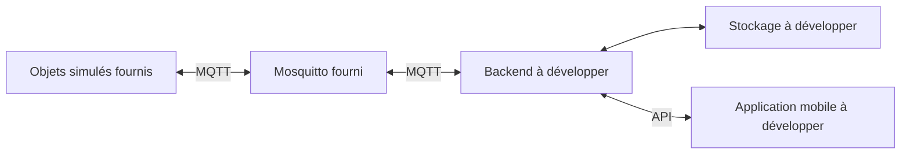

# Campus connecté — kit IoT & Mobile

Kit étudiant du projet **M2 Applications mobiles et objets connectés**. Il fournit un broker Mosquitto et des objets simulés ; vous réalisez **le backend, le stockage, l’API et l’application mobile**, dans les technologies de votre choix.

## Ce que vous recevez

- Trois objets (`sensor-001` à `sensor-003`), associés initialement aux salles 203 à 205.
- Des mesures de température (°C) et de CO₂ (ppm), toutes les deux secondes par défaut.
- Une ventilation simulée qui fait diminuer progressivement le CO₂ lorsqu’elle est activée.
- Un contrat MQTT documenté, des incidents reproductibles et des outils de diagnostic.
- Des tests unitaires, des tests MQTT et une recette de coupure/reconnexion Docker.



Le simulateur est écrit en Python pour rendre le kit lisible. **Cela n’impose pas Python pour votre backend.** Les outils de diagnostic ne stockent pas les mesures et ne constituent pas une solution backend.

## Démarrer en trois étapes

Prérequis : Git et Docker avec la commande `docker compose` (Docker Desktop démarré, conteneurs Linux sur Windows). Aucun Python local n’est nécessaire pour utiliser le kit et lancer les tests dans Docker.

```sh
git clone https://github.com/LargeGaultier/MdsIoTMobile.git
cd MdsIoTMobile
docker compose up -d --build --wait
```

Le premier démarrage télécharge les images et construit le simulateur. Ensuite :

```sh
docker compose ps
docker compose logs --tail 30 simulator
docker compose run --rm --build tools watch --count 10
```

Vous devez voir les messages des trois objets. L’outil affiche le topic, le contenu JSON et le drapeau `retained`. Pour ne voir que les mesures :

```sh
docker compose run --rm tools watch --topic "campus/v1/devices/+/telemetry" --count 3
```

## Connecter votre backend

| Où tourne le backend ? | Hôte MQTT | Port |
|---|---|---|
| Directement sur votre ordinateur | `localhost` | `1883` |
| Service ajouté dans ce Compose | `mosquitto` | `1883` |

Compte : `backend` / mot de passe initial : `backend-demo`. Abonnez-vous aux topics de télémétrie, état, disponibilité et résultat définis dans [le contrat MQTT](docs/contrat-mqtt.md). Publiez les commandes sur le topic de l’objet concerné.

Le mobile contacte **votre API**, avec une adresse accessible depuis son terminal. `localhost` sur un téléphone désigne le téléphone, pas votre ordinateur. Le port de votre API et son accès depuis le réseau local sont à configurer dans votre réalisation.

### Comptes pédagogiques

| Compte | Mot de passe initial | Usage |
|---|---|---|
| `simulator` | `simulator-demo` | Produire les mesures/états et recevoir les commandes/incidents |
| `backend` | `backend-demo` | Lire les données des objets et envoyer des commandes |
| `teacher` | `teacher-demo` | Diagnostic et injection d’incidents |

Les droits sont limités par `mosquitto/acl`. Les permissions de vos utilisateurs métier doivent être vérifiées **dans votre backend** : les comptes MQTT ne remplacent pas ces contrôles.

Ce sont des identifiants publics de démonstration. Le port MQTT est volontairement publié sur **127.0.0.1**, et les échanges du kit local ne sont pas chiffrés. Ce kit n’est pas une configuration de production ; ne l’exposez pas sur Internet. Chaque équipe utilise son propre environnement.

## Tester la ventilation

```sh
docker compose run --rm tools command sensor-001 on
docker compose run --rm tools watch --topic "campus/v1/devices/sensor-001/telemetry" --count 5
docker compose run --rm tools command sensor-001 off
```

Le diagnostic envoie une commande avec un identifiant et une expiration, puis attend le résultat de l’objet. `executed` confirme une action **dans le modèle simulé**. En cas d’absence de réponse, l’outil termine en erreur : cela ne constitue pas une preuve que l’action n’a pas eu lieu.

## Provoquer les incidents du cours

```sh
docker compose run --rm tools incident sensor-001 pause
docker compose run --rm tools incident sensor-001 resume
docker compose run --rm tools incident sensor-001 duplicate
docker compose run --rm tools incident sensor-001 delay
docker compose run --rm tools incident sensor-001 invalid
docker compose run --rm tools incident sensor-001 high-co2
docker compose run --rm tools incident sensor-001 normal-co2
docker compose run --rm tools incident sensor-001 no-response
docker compose run --rm tools incident sensor-001 respond
docker compose run --rm tools incident sensor-001 reset
```

Chaque ligne est une action indépendante, à déclencher au moment du scénario. La réponse `ok` confirme l’injection de l’incident, pas la réussite du backend étudiant.

| Action | Effet | À vérifier dans votre réalisation |
|---|---|---|
| `pause` / `resume` | Arrête/reprend les mesures de cet objet, connexion maintenue | Fraîcheur distincte de la connexion |
| `duplicate` | Republie la dernière mesure avec le même identifiant | Pas de doublon métier |
| `delay` | Émet une nouvelle mesure datée de 60 secondes auparavant | Pas de régression du dernier état |
| `invalid` | Émet une mesure où le CO₂ vaut le texte `invalide` | Rejet/qualification, service toujours disponible |
| `high-co2` / `normal-co2` | Place le CO₂ à 1800/600 ppm, puis reprend son évolution | Activation et résolution d’alerte |
| `no-response` / `respond` | Ignore/reprend les commandes ; les commandes ignorées ne sont pas rejouées | Attente bornée et résultat inconnu |
| `reset` | Reprend les mesures et commandes, CO₂ à 650, ventilation arrêtée | Retour à une situation normale |

`reset` ne vide pas l’historique de votre backend, ni le cache des commandes du simulateur. Chaque nouvelle intention doit avoir un nouvel identifiant de commande.

Interrompre le broker et le relancer :

```sh
docker compose stop mosquitto
docker compose up -d --wait mosquitto
```

Les objets se reconnectent automatiquement. Les mesures ne sont pas produites pendant la déconnexion ; aucune récupération complète de cet intervalle n’est promise. Pour tester un Last Will, `docker compose pause simulator` suspend les trois objets sans déconnexion propre ; attendre environ 8 à 15 secondes, puis `docker compose unpause simulator`.

## Ce qui reste à construire

1. Valider les messages et décider du traitement des erreurs, retards et doublons.
2. Conserver l’historique et calculer un dernier état fiable et sa fraîcheur.
3. Associer les objets aux salles, gérer les utilisateurs et leurs droits.
4. Suivre les commandes et leurs délais ; produire des alertes sans répétition inutile.
5. Exposer une API, construire le mobile, son cache et ses parcours réseau/caméra.
6. Démontrer les scénarios de recette sur le terminal choisi.

Les valeurs initiales de `room_id` servent de repères. L’affectation de référence dans votre application appartient au backend. Pour le scan QR, le contrat d’association et les contenus à encoder sont fournis dans [docs/association.md](docs/association.md).

## Configuration

Copiez `.env.example` en `.env` si vous souhaitez changer un paramètre (`Copy-Item .env.example .env` dans PowerShell, `cp .env.example .env` sous macOS/Linux). Sans ce fichier, les valeurs pédagogiques par défaut fonctionnent.

- `MQTT_PORT` : port sur l’ordinateur, à changer si 1883 est occupé (ex. 1884).
- `PUBLISH_INTERVAL` : intervalle en secondes, minimum 0.1, valeur initiale 2.
- `SIMULATOR_PASSWORD`, `BACKEND_PASSWORD`, `TEACHER_PASSWORD` : identifiants du kit local.
- `devices.json` : objets et salles, identifiants uniques ; de 1 à 100 objets.

Après modification : `docker compose up -d --build --force-recreate`. Après retrait d’objets, des états retained peuvent rester dans le broker ; utilisez un nouveau projet Compose ou la remise à zéro ci-dessous. La recette automatique utilise le parc initial de trois objets.

## Lancer les tests

Tests du modèle et des échanges MQTT, sur le kit démarré (ils modifient temporairement `sensor-001`) :

```sh
docker compose run --rm --build tests
```

Recette complète **isolée**, avec Python 3 sur l’ordinateur :

```sh
python tests/acceptance.py
```

Elle crée un projet Docker temporaire sur un port libre, vérifie les mesures, commandes, incidents, droits, accès anonyme refusé, interruption du broker, Last Will et redémarrage du simulateur. Elle supprime uniquement son propre projet et ses volumes à la fin. GitHub Actions lance la même recette à chaque push et pull request.

La validation du kit ne teste pas votre backend ni votre application mobile. Vous devez compléter ces preuves avec vos propres tests.

## Arrêter et remettre à zéro

```sh
docker compose down
```

Cette commande conserve le volume du broker. L’état du simulateur et son cache de commandes sont en mémoire : un redémarrage les réinitialise et produit de nouveaux identifiants de mesure.

Pour **effacer les messages conservés du broker** et repartir à zéro :

```sh
docker compose down -v
docker compose up -d --build --wait
```

## Dépannage

- Docker inaccessible : démarrer Docker Desktop et vérifier le mode conteneurs Linux.
- Port occupé : changer `MQTT_PORT` dans `.env`, puis recréer les services.
- Broker non sain : consulter `docker compose logs mosquitto` ; vérifier les variables de mots de passe et les fichiers montés.
- Pas de mesures : consulter `docker compose logs simulator`, vérifier le compte et les topics, puis `incident sensor-001 reset`.
- Commande sans retour : vérifier objet, droits, expiration et mode `no-response` ; conserver un résultat inconnu tant qu’il manque une preuve.
- Changements de code non visibles : relancer avec `--build`.

## Fichiers et références

- `compose.yaml` et `mosquitto/` : broker, comptes et droits.
- `simulator/` : modèle physique simplifié et client MQTT.
- `tools/` : diagnostic en ligne de commande.
- `tests/` : tests unitaires, réseau et recette Docker.
- [Contrat MQTT v1](docs/contrat-mqtt.md) : formats et garanties exactes.
- [Eclipse Paho Python](https://eclipse.dev/paho/files/paho.mqtt.python/html/client.html), [Mosquitto](https://mosquitto.org/man/mosquitto-conf-5.html), [Docker Compose](https://docs.docker.com/compose/how-tos/startup-order/).
